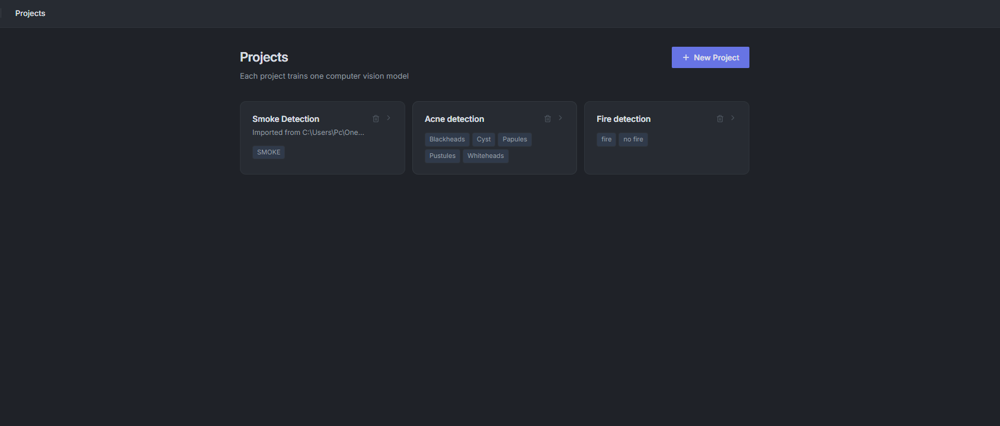
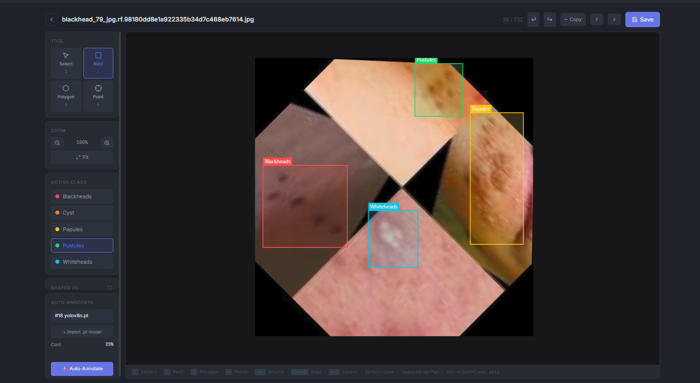
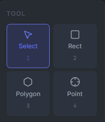
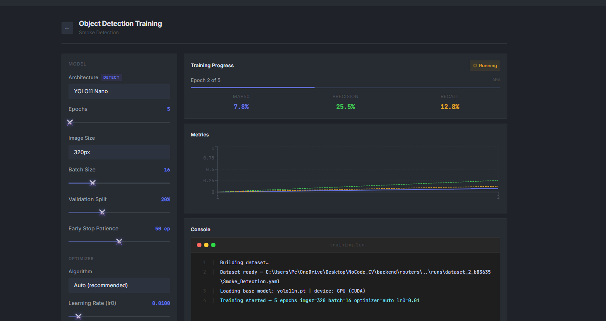
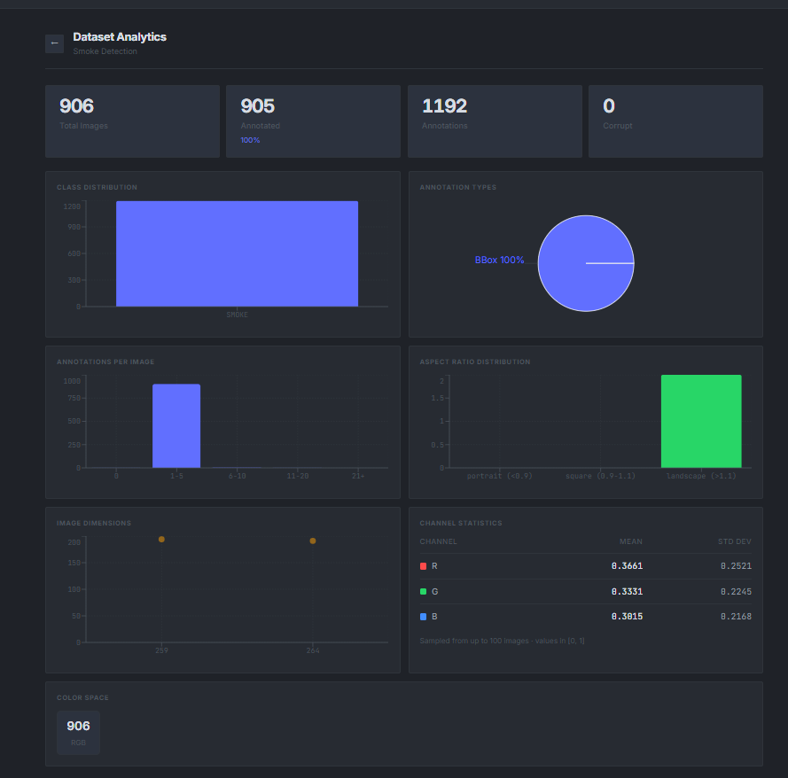
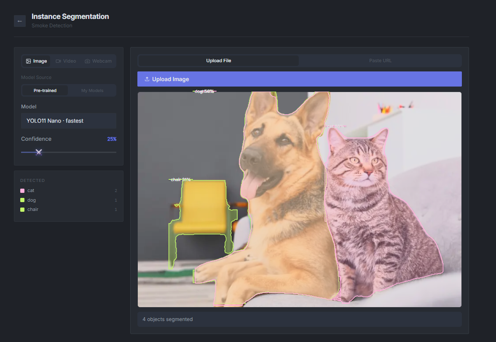
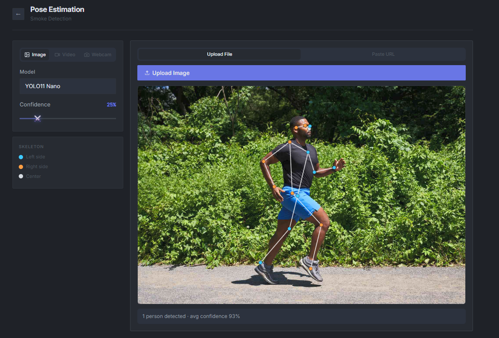
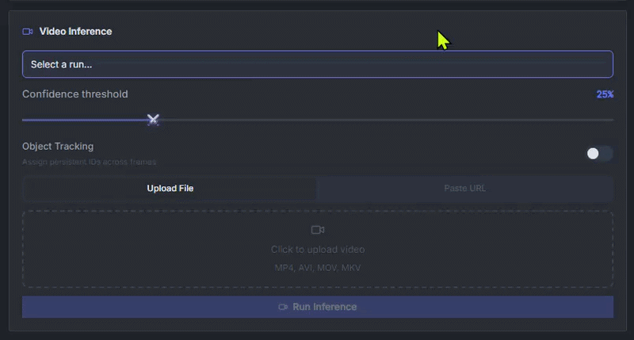
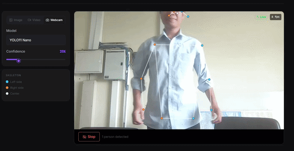

<div align="center">


<h1>NoCode CV</h1>

<p><em>Train computer vision models without writing a single line of code.</em></p>

[](https://python.org)
[](https://fastapi.tiangolo.com)
[](https://react.dev)
[](https://ultralytics.com)
[](LICENSE)
[]()

</div>

<br />
NoCode CV is a self-hosted computer vision workstation that runs entirely on your own machine. Annotate images, train YOLO models, run inference on video and webcam — all through a browser UI, all offline, no cloud account required.

One installer script sets everything up. One launcher starts it. Everything stays on your hardware.

```bash
# Windows
Install NoCode CV.bat

# macOS / Linux
chmod +x "Install NoCode CV.sh" && ./"Install NoCode CV.sh"
```

Then open **http://localhost:8000**.

<br />


<br />

---

## Table of Contents

- [What it does](#what-it-does)
- [Screenshots](#screenshots)
- [Installation](#installation)
- [Tech Stack](#tech-stack)
- [Project Structure](#project-structure)
- [Features](#features)
- [Dataset Import Formats](#dataset-import-formats)
- [Contributing](#contributing)

---

## What it does

Most CV tooling expects you to write training scripts, manage file paths, and understand YAML configs before you see a single prediction. NoCode CV skips all of that.

You create a project, upload images, draw annotations, pick a model size, and hit train. The live log streams directly in the browser. When training finishes, you can immediately run inference on images, video URLs, or your webcam — in the same UI, no terminal needed.

It's built for people who want to go from raw images to a working detector in an afternoon, not a week.

---

## Screenshots

### Projects



Each project is a self-contained workspace — its own images, annotations, class list, training runs, and exported models. You can have as many as you want running in parallel.

---

### Annotation Studio





Bounding box, polygon, and point tools on a pannable, zoomable canvas. Per-class color coding, undo/redo, and an auto-annotate button that runs any trained `.pt` model across all unannotated images in one click. Export to YOLO `.txt` or COCO JSON when you're done.

---

### Detection Training



Pick from YOLO11, v10, v9, or v8 in any size variant. Configure epochs, batch, image size, optimizer, learning rate, and 14 augmentation controls. Training output streams live in a color-coded log, and you can stop or resume any run at any time.

---

### Dataset Analytics



Before you train, it helps to know what's in your dataset. The analytics page shows class distribution, annotation heatmaps, image size scatter plots, aspect ratio buckets, and RGB channel stats — enough to catch a class imbalance or data quality issue before it wastes training time.

---

### Instance Segmentation



Pixel-level masks using YOLO11-seg. Works on images, video files, URLs, and live webcam. Supports pre-trained models or any custom `.pt` you've trained yourself.

---

### Pose Estimation



17-keypoint skeleton detection on images, video, or webcam using YOLO11-pose. Adjustable confidence threshold.

---

### Video Inference



Paste a YouTube, TikTok, Vimeo, or direct video URL — or upload a file. Optional ByteTrack object tracking assigns persistent IDs across frames. Download the annotated result when it's done.

---

### Live Webcam



Real-time detection or segmentation overlay from your camera. FPS counter, per-class instance counts, and a confidence threshold slider that updates live.

---

## Installation

### Requirements

| | Minimum | Recommended |
|---|---|---|
| Python | 3.9 | 3.11 |
| RAM | 8 GB | 16 GB |
| GPU | CPU works | NVIDIA CUDA |
| Disk | 5 GB | 20 GB |
| OS | Windows 10 / macOS 12 | Windows 11 / macOS 14 |

### One-line install

```bash
# Windows
Install NoCode CV.bat

# macOS / Linux
chmod +x "Install NoCode CV.sh" && ./"Install NoCode CV.sh"
```

The installer creates a Python virtual environment, installs all dependencies, builds the frontend, and drops a launcher on your desktop.

### Manual install

```bash
git clone https://github.com/Chandaro/NoCode-Computer-Vision.git
cd NoCode-Computer-Vision

python -m venv venv
venv\Scripts\activate          # Windows
# source venv/bin/activate     # macOS / Linux

pip install -r backend/requirements.txt

cd frontend && npm install && npm run build && cd ..

cd backend && uvicorn main:app --host 0.0.0.0 --port 8000
```

### GPU (NVIDIA CUDA)

The app detects CUDA automatically. For best performance, install the CUDA-enabled PyTorch build before the requirements:

```bash
pip install torch torchvision --index-url https://download.pytorch.org/whl/cu121
```

---

## Tech Stack

| Layer | Technology |
|---|---|
| Frontend | React 18, TypeScript, Vite, Tailwind CSS |
| Backend | Python, FastAPI, SQLModel, SQLite |
| CV / ML | Ultralytics YOLO, PyTorch, torchvision, OpenCV |
| Video | yt-dlp, OpenCV VideoWriter |
| Charts | Recharts |
| Icons | Lucide React |

---

## Project Structure

```
NoCode-Computer-Vision/
├── backend/
│   ├── main.py              — FastAPI entry point
│   ├── models.py            — SQLModel schemas
│   ├── database.py          — DB session
│   └── routers/
│       ├── projects.py      — project & image CRUD
│       ├── annotate.py      — annotation endpoints
│       ├── train.py         — training orchestration
│       ├── infer.py         — image / video / URL inference
│       ├── classify.py      — classification training
│       ├── segment.py       — segmentation inference
│       ├── pose.py          — pose estimation
│       └── webcam.py        — webcam streaming
├── frontend/
│   ├── src/
│   │   ├── pages/           — one file per feature
│   │   ├── components/
│   │   │   └── ui.tsx       — shared design system
│   │   ├── api.ts           — Axios client
│   │   ├── App.tsx          — router
│   │   └── index.css        — design tokens
│   └── public/
│       └── favicon.svg
├── installer.py
├── launcher.py
├── Install NoCode CV.bat
├── Install NoCode CV.sh
└── docs/screenshots/
```

---

## Features

**Annotation** — bounding box, polygon, and point tools with auto-annotate. Exports to YOLO and COCO.

**Object Detection** — fine-tune YOLO11 / v10 / v9 / v8 with live training logs, augmentation controls, and stop/resume.

**Image Classification** — transfer learning on ResNet, MobileNet, EfficientNet. Top-5 accuracy, confusion matrix, per-class breakdown.

**Custom CNN Builder** — stack Conv2D, pooling, batch norm, dropout, and linear layers visually. Train on your own images.

**Dataset Analytics** — class distribution, heatmaps, aspect ratios, RGB stats. Everything you need before you hit train.

**Video Inference + Tracking** — file upload or URL, ByteTrack object tracking, downloadable output.

**Instance Segmentation** — pixel masks on images, video, and webcam using YOLO11-seg.

**Pose Estimation** — 17-keypoint skeleton on images, video, and webcam using YOLO11-pose.

**Live Webcam** — real-time detection or segmentation overlay with FPS counter and per-class stats.

**Evaluation** — mAP50, F1, precision/recall curves, confusion matrix, and batch test set evaluation.

---

## Dataset Import Formats

NoCode CV imports YOLO-format datasets. Two modes:

**Folder import** — select a folder with `images/` and `labels/` subdirectories. Filenames must match (`.jpg` ↔ `.txt`).

```
my-dataset/
├── images/
│   ├── photo_001.jpg
│   └── photo_002.jpg
└── labels/
    ├── photo_001.txt
    └── photo_002.txt
```

**Flat file import** — select image files and their matching label files together in one picker. Same base name requirement.

**Label format** — one line per object, all values 0–1 normalised:

```
class_id  cx  cy  width  height
```

```
0 0.512 0.480 0.300 0.420
1 0.210 0.340 0.150 0.200
```

Compatible with exports from Roboflow, CVAT, LabelImg, and Label Studio.

---

## Contributing

```bash
git checkout -b feat/your-feature
# make changes
git commit -m "feat: describe what you did"
git push origin feat/your-feature
# open a pull request
```

TypeScript strict mode on the frontend, type hints where practical on the backend.

---

<div align="center">
  <sub>MIT © <a href="https://github.com/Chandaro">Tekashimo</a> · FastAPI · React · Ultralytics YOLO · PyTorch</sub>
</div>
